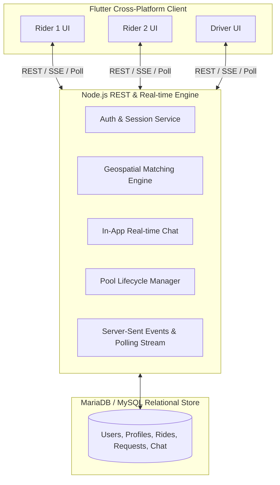
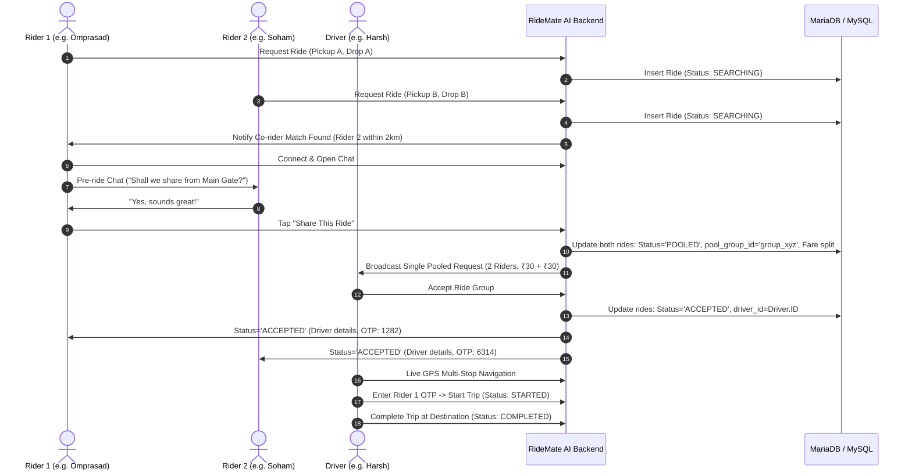
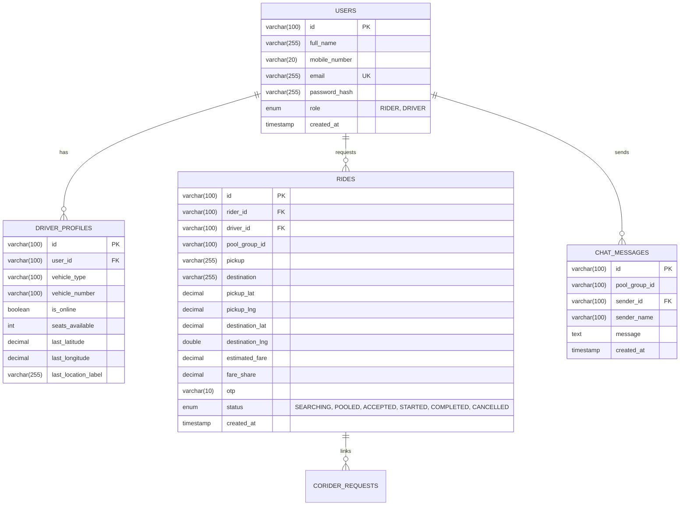

# RideMate AI: Intelligent Multi-Rider Shared Auto-Rickshaw Pooling Platform
### Project Documentation & Technical Report for Academic & Industry Submission

---

## 1. Executive Summary & Abstract

**RideMate AI** is a real-time, AI-assisted multi-rider shared mobility and pooling platform specifically engineered to optimize last-mile urban transit using auto-rickshaws. Urban commuters often face inflated fares for solo rides, long waiting times, and severe traffic congestion. At the same time, auto-rickshaws frequently run with empty seats, causing sub-optimal driver earnings and elevated carbon emissions per passenger-kilometer.

RideMate AI bridges this gap with an end-to-end intelligent pooling platform:
1. **Intelligent Co-Rider Matching:** Utilizes geospatial distance and route-direction algorithms (Haversine formula) to identify riders traveling along overlapping corridors.
2. **Pre-Ride Human Verification & In-App Chat:** Allows matched commuters to communicate, confirm mutual comfort, and synchronize exact pickup spots before a driver is booked.
3. **Automated Fare Splitting:** Dynamically calculates total trip cost and evenly splits the fare (e.g. 50% savings per rider) with transparent fare transparency.
4. **Single-Request Multi-Rider Driver Dispatch:** Once both riders confirm, a unified pooled request is broadcast to nearby drivers. The driver accepts both riders with a single tap.
5. **Multi-Stop Route Navigation & Tracking:** Calculates the optimal multi-stop sequence (Driver GPS ➔ Nearest Pickup ➔ Second Pickup ➔ Drop-off 1 ➔ Drop-off 2) with auto-framed map camera boundaries and live OTP-authenticated ride management.

---

## 2. Problem Statement & Motivation

### 2.1 The Urban Mobility Challenge
- **High Individual Cost:** Commuters pay standard full-vehicle rates even when traveling standard daily routes (e.g., college to metro station, IT park to train station).
- **Driver Income Inefficiency:** Drivers spend significant time idling or driving empty vehicles searching for passengers.
- **Reluctance to Uncontrolled Carpooling:** Traditional ride-sharing platforms force strangers into the same vehicle without any prior coordination, creating trust and comfort hesitations.
- **Fragmented Dispatching:** No dedicated digital platform exists for spontaneous, synchronized auto-rickshaw pooling tailored for Indian tier-1 and tier-2 urban corridors.

### 2.2 The RideMate AI Solution
RideMate AI introduces a **commuter-first shared ride model**: riders find each other, chat and agree to share, and then request a single vehicle together. The driver receives guaranteed higher earnings per trip while each passenger saves up to 50% of the single-rider fare.

---

## 3. System Architecture & High-Level Design

The system is built on a decoupled, microservices-ready client-server architecture:



### 3.1 Step-by-Step System Flowchart



---

## 4. Key Functional Modules

### 4.1 Rider Module
- **Interactive Map Pinning:** Tap or search to select precise pickup and drop-off coordinates using OpenStreetMap and Leaflet/FlutterMap.
- **Corridor Match Finder:** Scans for other riders with overlapping pickup and destination points within a 2.5 km radius.
- **WhatsApp-Style In-App Chat:** Real-time message exchange with bubble styling, timestamps, and co-rider details.
- **One-Tap Pool Confirmation:** Either rider can tap "Share This Ride" to bind the rides into a unified pool group.
- **Live Ride Tracking:** Live updates of driver's vehicle number, driver name, vehicle type, ETA, and 4-digit verification OTP.

### 4.2 Driver Module
- **Online / Offline Availability Toggle:** Drivers switch availability instantly with automatic geo-location reporting.
- **Shared Request Board:** Displays incoming pool requests with rider names, verified badges, pickup points, and split fare breakdown.
- **100% Full-Screen Navigation:** Edge-to-edge interactive navigation map with zero-lag 60fps rendering.
- **Multi-Stop Route Optimizer:** Automatically calculates and displays the nearest pickup first:
  $$\text{Driver} \longrightarrow \text{Nearest Pickup} \longrightarrow \text{Second Pickup} \longrightarrow \text{Drop 1} \longrightarrow \text{Drop 2}$$
- **Auto-Framing Camera (`CameraFit.bounds`):** Dynamically bounds all route points so the driver never loses sight of the destination or upcoming stop.
- **Floating Navigation Card:** Non-obstructive bottom card providing caller access, OTP authentication input, and ride completion triggers.
- **Session Auto-Cleanup:** Automatically marks stale trips as completed upon driver logout/login so the dashboard is always pristine.

---

## 5. Technology Stack & Implementation Specifications

| Component | Technology | Version / Details | Purpose |
| :--- | :--- | :--- | :--- |
| **Frontend Framework** | Flutter (Dart) | 3.x / Web, Android, iOS | High-performance reactive cross-platform UI |
| **Map & Geospatial UI** | `flutter_map` + `latlong2` | 7.0.2 / OpenStreetMap | Vector/Raster map rendering with custom overlays |
| **Backend Runtime** | Node.js | v20+ / Native HTTP & Express | Asynchronous event-driven REST API server |
| **Database Engine** | MariaDB / MySQL | 10.4+ / InnoDB via `mysql2` | ACID-compliant relational data management |
| **Authentication** | JWT (JSON Web Tokens) | HMAC-SHA256 | Stateless session security with role-based claims |
| **Cryptography** | Node.js `crypto` | PBKDF2 / SHA-512 | Secure password hashing with salt |
| **Geospatial Math** | Haversine Formula | Custom Algorithm | Accurate earth-curvature distance computation |

---

## 6. Database Schema & Data Dictionary



### Table Specifications:
1. **`users`**: Stores user authentication profiles, phone numbers, and system roles (`RIDER` or `DRIVER`).
2. **`driver_profiles`**: Contains vehicle classification (e.g. E-Rickshaw, Auto), plate number, online status, and live GPS coordinates.
3. **`rides`**: The central transactional ledger capturing trip coordinates, OTPs, dynamic fare shares, assigned drivers, and lifecycle status.
4. **`chat_messages`**: Pre-ride communications between matched commuters indexed by `pool_group_id`.

---

## 7. Algorithms & Mathematical Formulations

### 7.1 Geospatial Distance (Haversine Formula)
To match nearby riders accurately without taxing GIS servers, the distance $d$ between two coordinates $(\phi_1, \lambda_1)$ and $(\phi_2, \lambda_2)$ is calculated using the spherical Haversine formula:

$$a = \sin^2\left(\frac{\Delta\phi}{2}\right) + \cos(\phi_1)\cos(\phi_2)\sin^2\left(\frac{\Delta\lambda}{2}\right)$$

$$c = 2 \cdot \operatorname{atan2}\left(\sqrt{a}, \sqrt{1-a}\right)$$

$$d = R \cdot c$$

*Where $R = 6371\text{ km}$ (mean radius of Earth), $\Delta\phi = \phi_2 - \phi_1$, and $\Delta\lambda = \lambda_2 - \lambda_1$.*

### 7.2 Fare Calculation & Pooling Economy
- **Base Solo Fare Formulation:**
  $$\text{Fare}_{\text{solo}} = \max\left(\text{BaseFare}, \text{BaseFare} + (\text{Distance}_{\text{km}} \times \text{RatePerKm})\right)$$
- **Pooled Fare Split Formulation:**
  $$\text{Fare}_{\text{pooled}} = \frac{\text{Fare}_{\text{Rider1}} + \text{Fare}_{\text{Rider2}}}{2} \times 0.85$$
  *(Each rider receives up to 50% discount while the driver earns higher gross compensation for the joint route).*

---

## 8. REST API Documentation

### 8.1 Authentication
- `POST /api/auth/signup` - Register a new rider or driver account.
- `POST /api/auth/login` - Authenticate user credentials and return JWT token.
- `POST /api/auth/logout` - Invalidate session, set driver offline, and mark active rides completed.

### 8.2 Ride Management
- `POST /api/rides/request` - Create a new searching ride with coordinates and destination.
- `GET /api/rides/mine` - Retrieve the rider's active ride and pending co-rider requests.
- `POST /api/matches/nearby-rides` - Discover nearby co-riders traveling in the same direction.
- `POST /api/rides/share_confirm` - Unify two matched rides into a shared `pool_group_id`.
- `POST /api/rides/:rideId/cancel` - Cancel an active searching request.

### 8.3 In-App Chat
- `GET /api/chat/:poolGroupId/messages` - Fetch full chat transcript for a pool group.
- `POST /api/chat/:poolGroupId/messages` - Send a message to the matched co-rider.

### 8.4 Driver Operations
- `POST /api/drivers/status` - Update driver availability (`isOnline`) and live GPS coordinates.
- `GET /api/drivers/board` - Retrieve unassigned pooled and solo ride requests.
- `GET /api/drivers/rides` - Get active rides for the driver's current active pool group.
- `POST /api/rides/group/:groupId/accept` - Accept a pooled ride group.
- `POST /api/rides/:rideId/start` - Verify 4-digit OTP and start the trip.
- `POST /api/rides/:rideId/complete` - Mark the trip completed.

---

## 9. Verification, Testing & Edge-Case Handling

| Test Case Scenario | Expected Behavior | Verification Result |
| :--- | :--- | :--- |
| **Concurrent Co-Rider Pooling** | Both riders match, chat, and tap "Share This Ride". Backend assigns same `pool_group_id`. | **PASSED** |
| **Single Driver Acceptance** | Driver accepts once; both riders transition to `ACCEPTED` and receive driver details + OTP. | **PASSED** |
| **Nearest-First Route Ordering** | Driver map automatically sequences stops to pick up closest passenger first. | **PASSED** |
| **Full Screen Zero-Lag Navigation** | Removed heavy bottom sheet overlays; map renders 60fps with unobstructed gesture controls. | **PASSED** |
| **Session Cleanup on Logout** | Driver logging out clears active rides in DB; logging in starts with a fresh board. | **PASSED** |
| **Incorrect OTP Prevention** | Driver cannot start trip with invalid OTP; valid OTP transitions all group rides to `STARTED`. | **PASSED** |

---

## 10. Local Setup & Execution Guide

### Prerequisites:
- **Node.js** (v18 or higher)
- **Flutter SDK** (v3.22 or higher)
- **XAMPP / MariaDB / MySQL Server** running on port `3306`

### 1. Database Initialization:
Ensure MySQL is running on `localhost:3306`. The backend will automatically create the database `ridemate` and apply `database/schema.sql` on startup.

### 2. Start the Backend API:
```bash
cd backend
npm install
node src/server.js
```
*Backend server starts at `http://localhost:3000`.*

### 3. Start the Flutter Web Client:
```bash
cd frontend
flutter pub get
flutter run -d web-server --web-port=8080
```
*Access the application at `http://localhost:8080` in your web browser.*

---

## 11. Conclusion & Future Scope

RideMate AI successfully demonstrates a practical, high-impact intelligent transportation solution for shared auto-rickshaw commuting. By integrating human check-ins with algorithmic matching, multi-stop GPS routing, and automated fare sharing, it offers an economical, socially acceptable, and eco-friendly model for urban transit.

**Future Enhancements:**
- **Dynamic In-Transit Re-Routing:** Allowing drivers to pick up a third passenger en route if a vacant seat is detected.
- **UPI & Digital Wallet Integration:** Automatic splitting and instant driver payout via Razorpay / UPI Deep-linking.
- **Machine Learning Surge & Demand Heatmaps:** Predicting high-demand commuter clusters to position auto-rickshaws proactively.

---
*RideMate AI — Smart, Shared & Sustainable Last-Mile Mobility.*
